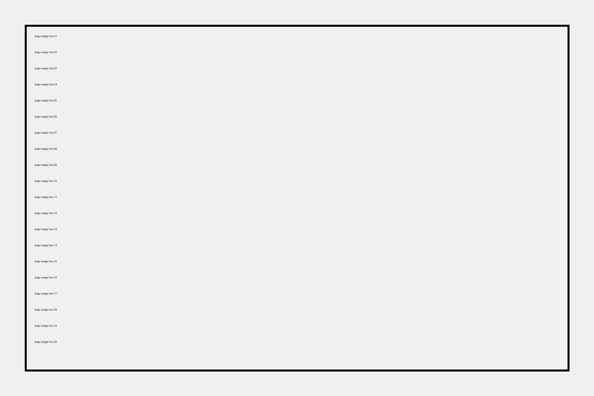

# Large Image Fixture

A large image should cause the preview to change height after decode/layout. Anchor sync should preserve the active anchor without jumping.

Paragraph before the large image.

Paragraph after the large image.

| Column | Value |
|:--|--:|
| Width | Large |
| Height | Large |
