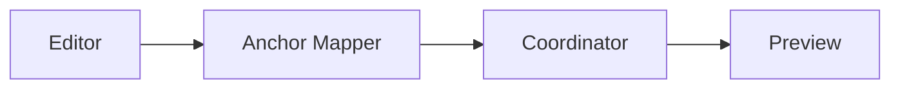
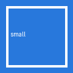

# Mixed Content Fixture

This file combines headings, prose, lists, tables, code, Mermaid, images, blockquotes, and thematic breaks.

## Prose

A paragraph with **formatting** and a link: https://muxy.app.

> Blockquote line 1
> Blockquote line 2

---

## Lists

1. Ordered item one
   - nested bullet A
   - nested bullet B
2. Ordered item two

## Table

| Key | Value |
| --- | --- |
| mode | anchor-sync |
| status | wip |

## Code

```swift
enum Mode {
    case percent
    case anchors
}

let current: Mode = .anchors
```

## Mermaid



## Images



Paragraph after the image.
